# focusstack — Progress Showcase

*A visual tour of the engine as it stands today: what it does, how it thinks, the
mathematics underneath, the evidence behind every claim — and where it goes next.
This note is a milestone, not a destination.*

---

## The problem, and the result

A lens can only focus at one distance. Anything nearer or farther is blurred by the
optics — the deeper the scene, the worse the compromise. **Focus stacking** takes
several photographs of the same scene focused at different depths and fuses them
into one image that is sharp everywhere.

Below: two real light-field captures — one focused on the chain-link fence, one on
the players behind it — and the engine's fusion. Both the fence *and* the gym are
sharp, with no halo around the wires:

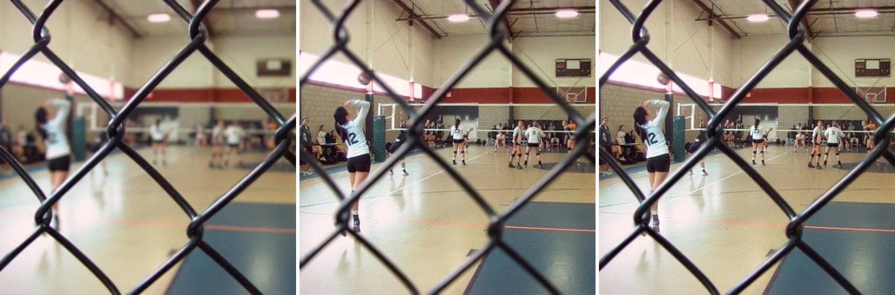
*Left: near focus (fence sharp, gym blurred). Middle: far focus (gym sharp, fence a
soft smear). Right: `focusstack` output — everything sharp.*

This is a genuinely hard case: the fence is a *thin, high-contrast structure over a
sharp background*, the exact geometry where classical fusion methods leave bright
halos or grey, ghosted wires.

---

## How it thinks

The engine's reasoning is visible. For the fence pair, left to right: where it
measures sharp detail, which frame wins each pixel, the cleaned-up weight it
actually uses, and the fused result:

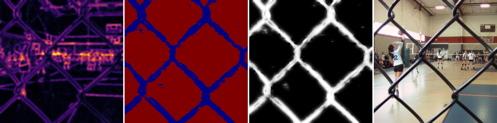
*Left: focus-energy map (bright = sharp detail present). Second: raw per-pixel
winner (blue = fence frame, red = background frame). Third: the guided weight for
the fence frame — the raw decision cleaned into a smooth, edge-snapped lattice.
Right: the fusion.*

That strip is the whole philosophy in one image: **measure sharpness, decide per
location, clean the decision so it follows real object edges, then reconstruct
without seams.** Everything below is the mathematics of doing each step right.

---

## The five ideas

### 1. Focus is high-frequency energy that survived

Defocus is a physical low-pass filter: a point at depth $z$ images to a disk (the
*circle of confusion*) with radius proportional to its distance from the focal
plane, $r \propto |z - z_f|$. Blur with a disk kernel erases fine detail — so
**sharpness is simply the high-frequency energy that survived**. We measure it with
second-derivative operators, pooled over a small window for noise robustness:

$$E(x,y) = \big|\nabla^2 I\big| * w \quad\text{(Laplacian energy, box-pooled)}$$

One measured subtlety: on smooth, low-contrast surfaces (polished metal, gradual
shading) the signed Laplacian $I_{xx} + I_{yy}$ can *cancel* — curvature in $x$
offsetting curvature in $y$ — hiding real focus. The **modified Laplacian**
$|I_{xx}| + |I_{yy}|$ can't cancel, and measurably wins there. The engine routes
between the two per pixel by local contrast (`content_aware`), so textured and
smooth regions each get the operator that suits them.

### 2. Decide, then clean the decision — with no edge detector

The raw per-pixel winner map is speckled (noise flips ties) and ragged at object
boundaries. We clean it with a **guided filter**: inside each local window, fit the
weight map $p$ as a linear function of the image $I$ itself:

$$q = aI + b, \qquad a = \frac{\mathrm{cov}(I, p)}{\mathrm{var}(I) + \epsilon}$$

Where the image is flat, $\mathrm{var}(I)$ is small, $a \to 0$, and the decision is
smoothed. Where the image has a real edge, $\mathrm{var}(I)$ is large, $a \to 1$,
and the decision *snaps to that edge*. **Edge-awareness emerges from local variance
— there is no explicit edge detector to tune, and the whole filter is a handful of
box filters (O(1) per pixel, any radius).**

### 3. Decide per scale — the centerpiece

The deepest lesson of this project: **a single decision scale cannot be right.** A
window tuned for 500-pixel images is far smaller than the blur disks in a 4K image;
scale it up globally and it destroys exactly the fine details high resolution
exists to capture. Measuring a local scale map helps, but there is a cleaner
answer.

Decompose each frame into a **Laplacian pyramid** — a stack of frequency bands:

$$L_i = G_i - \mathrm{up}(G_{i+1}), \qquad G_{i+1} = \mathrm{down}(G_i)$$

where each band holds exactly the detail the next blur-and-halve removed
(reconstruction is exact: collapse by $\mathrm{up}$-and-add). Now make the
**edge-aware decision of idea 2 independently at every band**, with one fixed
small window. Because band $i$ is downsampled $2^i\times$, that fixed window
*automatically* covers $2^i\times$ the area at full resolution:

> **A fixed small window per band *is* local scale — at every location,
> structurally, with zero magic numbers and no scale-estimation step.**

This method — `perband`, the engine's default — is the unique combination of four
properties, each of which we watched fail when absent:

| Property | Without it |
|---|---|
| Edge-aware decision (idea 2) | speckle and seams (`max`) |
| Confidence-hardened decision (idea 4) | greyed thin structures, defocus-spread bleed |
| **Multi-scale decision** (idea 3) | ranking reversals between low-res and high-res |
| Multi-band reconstruction | visible seams at region transitions |

Classical Laplacian-pyramid fusion has the multi-scale decision but no
edge-awareness — it **halos**. Guided multiband blending has edge-awareness but
one single-scale decision — it **softens fine detail at high resolution**. Look:

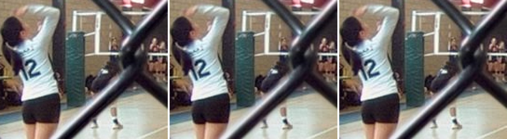
*3× zoom on the fence wires. Left — classical pyramid fusion: note the bright halo
hugging the wire. Middle — guided blend: clean but slightly soft. Right — `perband`:
clean **and** the sharpest wire edges.*

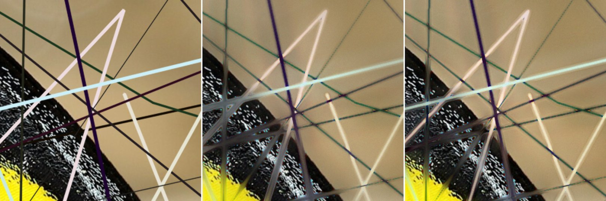
*High-resolution benchmark with thin structures at a different depth than the
background (ground truth on the left). Middle — blend's single-scale decision
smears the fine lines wide and grey. Right — `perband` keeps them thin. Not yet
perfect — this is the hardest regime we test — but clearly closest to truth.*

### 4. Confidence hardening — one formula, two rescues

Soft blending has a failure mode: where one frame is *decisively* the sharp one (a
hair, a wire, a bright point), blending in the other frame's contribution imports
its defocus — thin structures fuse grey, and bright out-of-focus disks ("defocus
spread") bleed over sharp backgrounds. The fix is to measure decision confidence
from the top-two focus energies,

$$c = \frac{E_{(1)} - E_{(2)}}{E_{(1)}}, \qquad
w = (1 - c)\,w_{\text{soft}} + c\,\mathbb{1}_{\text{winner}}$$

and push the weight toward a hard selection exactly where confidence is high,
keeping soft blending where focus is genuinely ambiguous. One mechanism, two
failure modes cured:

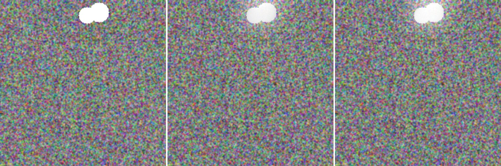
*Zoom on a bright structure over noise texture. Left — ground truth: pure white.
Middle — fusion without hardening: the structure fuses dimmed and hazy. Right —
with hardening: restored to near-white.*

### 5. Physical invariants make it robust for free

Real capture wobbles: auto-exposure drifts brightness and white balance between
frames, which measurably breaks fusion (−0.025 SSIM in our drift benchmark). The
fix rests on a small theorem: **blur preserves the mean** — a defocused frame has
(essentially) the same channel means as a sharp one. So *any* difference in frame
means within a stack is exposure, never focus, and a per-frame scalar gain toward
the stack median removes drift without touching focus content. It is provably
near-identity on undrifted stacks, so it runs by default:

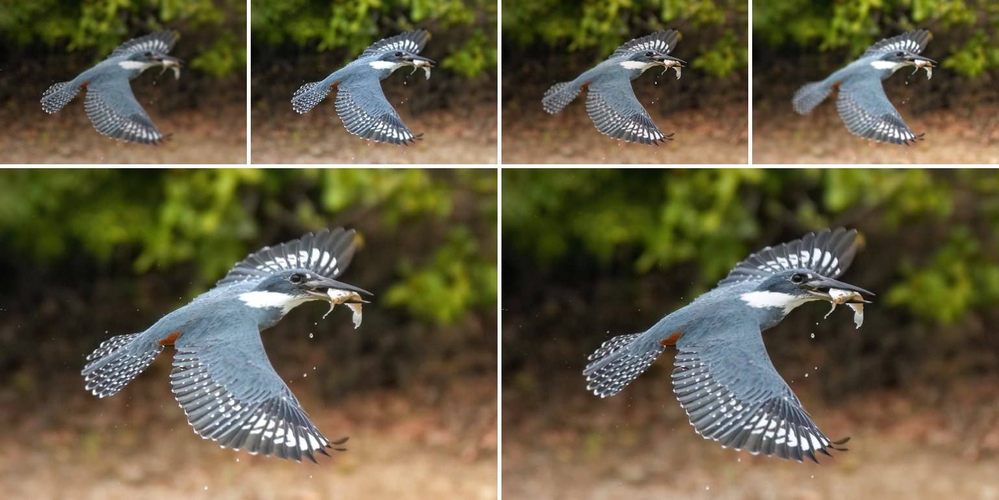
*Top: four frames of one stack with injected exposure/white-balance wobble (note
the brightness differences). Bottom: fused without (left) and with (right)
normalization. The visual difference is subtle at this size — the measured
difference is −0.023 SSIM — which is itself a lesson we keep: metrics catch what
the eye misses, and vice versa.*

And a byproduct falls out for free: in an $N$-frame stack, *which frame wins* each
pixel encodes depth — the winner index is a coarse **depth-from-focus** map
(`--depth-out`):

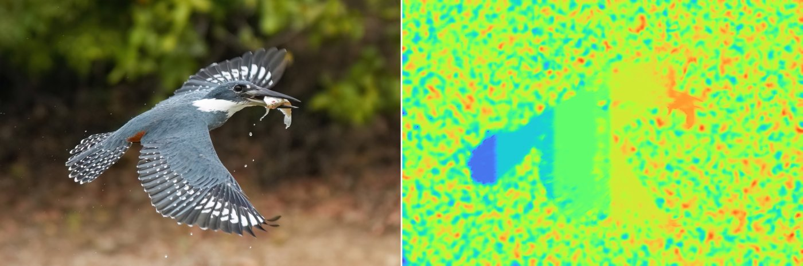
*An 8-frame stack over a left-to-right depth ramp. The textured subject reads the
ramp cleanly (blue → orange); the featureless background is speckle — depth from
focus is only observable where there is texture, a documented physical limitation,
not a bug.*

---

## Real optics, not just synthetic

Everything above must survive contact with *real* defocus — actual lens physics,
not simulated disks. On real fluorescence-microscopy z-stacks (BBBC006, genuine
optical defocus, three focal planes):

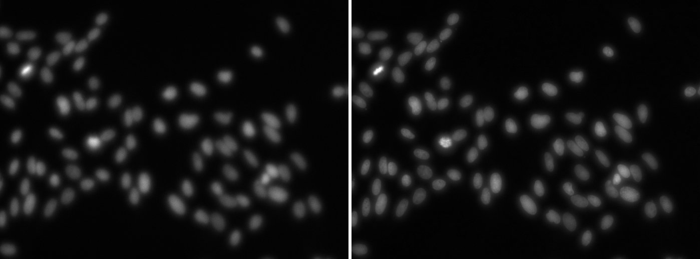

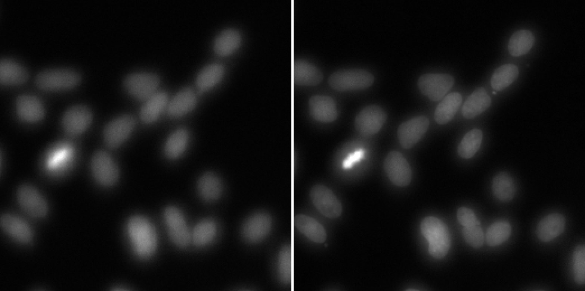
*3× zoom. Left: one source plane — nuclei are soft blobs. Right: the fusion —
boundaries tighten and internal chromatin speckle becomes visible. On this real
data the classical pyramid method visibly softens and halos; `perband` is the
sharpest, confirming the synthetic conclusions on genuine optics.*

## The specialist layer — routing, gates, and refusal

The specialist architecture began in F43–F48 and was stress-tested again in F54.
The generalist engine above is what every
stack gets. On top of it sit **specialists**: narrow mechanisms that fix physics the
generalist provably cannot (a lens mixes both sides of a depth boundary into the
captured pixels — no weighting scheme can unmix a contour, and no weighting can
recover a wide occluder's latent background). Two narrowly licensed mechanisms are
live; the historical correction-after-fusion veil operator remains explicitly
retired:

- **Contour reconstruction** (thin occluders — wires, stems, hairs): re-renders the
  contaminated boundary band as a fresh composite from a pixel-precise difference
  matte. Purely classical; no extra dependencies.
- **Joint-layer one-sided opaque recovery** (narrow auto path): solves
  both captured formation equations for observed foreground/background corrections,
  then keeps only components stable across three regularizers and two PSF families.
  Semantic candidates must first improve observation-domain fit under a frozen
  high-precision license; focus ownership vetoes edits on foreground evidence.
  Semantic support seen only in the sharp owner frame may be either a detached
  fragment or the novel tail of a high-overlap parent silhouette. Both must
  independently improve captured-frame fit—the broader parent has stronger
  containment, IoU, and relative-gain requirements—before observed foreground
  pixels can override mixed fusion. F62 now lets a forward-winning focused-owner
  silhouette replace mixed-base geometry, directly reconstructs its optically
  partial front interior, and only then invokes F61's positive rear-observation
  rule. That closes the foreground-partition tail on both diagnosed fires and the
  S16 counterexample. A genuinely post-final 72-scene S19 split then yields three
  all-partition-positive fires and 69 exact refusals. F68–F75 subsequently repair
  the one-sided opaque formation/ownership contract; frozen post-rule S29 licenses
  11 cases and refuses one, with all 11 improving every physical partition and
  exact far identity. F76 enables that validated two-frame/size-bounded path in
  auto enhancement. F78 integrates the recovered field at the 10%
  aperture-coverage contour by subtracting predicted front radiance, dividing by rear
  transmission, selecting the locally better forward PSF, and allowing exterior
  extrapolation only for proposal-specific below-noise components.

Here is contour reconstruction on a factory thin-occluder scene — one where the
shipped gate actually fires (predicted gain +0.0044 ≥ margin +0.0040; the actual
GT-SSIM gain was +0.0071):

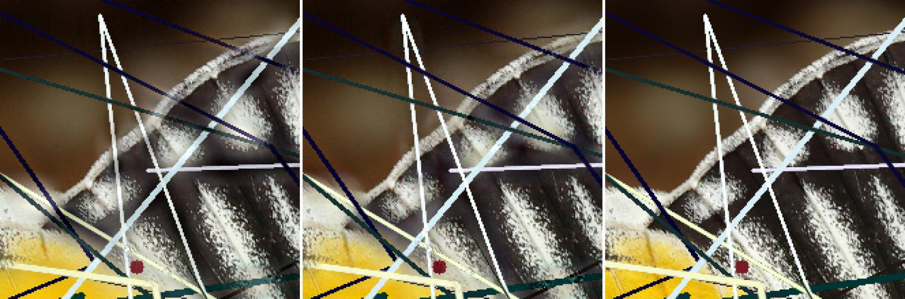
*3× zoom, crop chosen by disagreement (not by hand). Left — base `perband`
fusion: the thin white spike and several lines fuse semi-transparent, the blurred
background bleeding through them. Middle — after contour reconstruction: the same
structures come back solid and continuous. Right — ground truth. The background
itself is untouched — only the contaminated band around each contour was
re-rendered.*

And the same crop through the specialist's eyes — the inputs the mechanism
actually runs on:

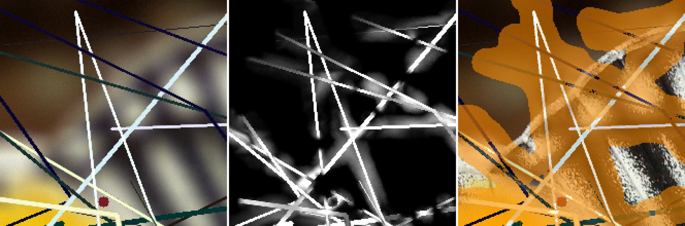
*Left — the frame that owns the contours (occluders in focus, background
defocused). Middle — the C3 difference matte: inpaint the owner frame over the
support to get a background plate, then α = normalized |owner − plate| — bright
exactly on the structures, however thin (the softer grey mass is honest residual
where the plate estimate is imperfect). Right — the contamination band (orange)
around every contour: only this band gets re-rendered; everything outside it
keeps the base fusion byte-for-byte.*

The veil arc is shown here as a falsification, not a capability claim:


*2.5× GT-error-guided crop from a realistic object-occluder factory scene. Left —
subtraction-only result. Middle — the rejected multiplicative recovery, which
darkens and distorts background/edge structure already contributed by the other
frame. Right — ground truth. Both recovery inputs are oracle matte + oracle radius,
yet global SSIM falls 0.9566 → 0.9372. This counterexample overturned the earlier
simple-blob result and is why that correction-after-fusion operator remains retired
rather than “fixed” by a more selective benchmark.*

Its replacement is a different model, shown on a fresh holdout scene where the
actual shipped package license fires:

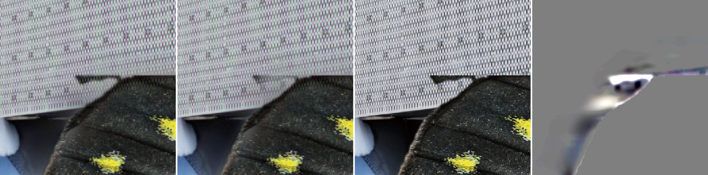
*2.5× disagreement-guided crop. Left to right: base `perband`,
owner-support-completed joint-layer recovery, physical ground truth, and the
signed edit amplified 5×. The
recovery attenuates the horizontal veil/smear at the black boundary and moves it
toward the clean GT edge; it does not fully reach GT. The amplified panel is an edit
locator, not a severity view. On this scene, global MAE improves 10.087 → 9.899 and
GT-SSIM +0.00116. The smooth-region false-texture index changes +0.013 gray at the
contour, disclosed rather than rounded to zero.*

For inspection rather than presentation, open the
**[Owner Inspection Lab](INSPECTION.html)**. Its physical-stress section now shows
seven shipped F76 sentinels rerun on frozen post-rule S29 inputs, with no legacy
formation or stale lower panels: every input, the unamplified base/output slider,
runtime alpha/focused-owner/rear-application maps, GT-only hard ownership and error
maps, all six physical partitions, and automatically selected edit and regression
crops.
A separate normal-photo section runs the actual default pipeline on four classic
real two-frame photographs and two real phone sweeps. Every original frame is
shown beside the aligned/normalized stack, final output, focus-winner map, and
post-fusion specialist edit. Runtime fires and refusals are both exposed for
direct inspection without pretending that no-GT data certifies a win.

The contour specialist sits behind an **outcome-trained gate**: candidates are
scored by a model trained on factory scenes where the ground truth is known,
predicting *the actual quality change of firing*. F54 also demonstrated the limit of
that recipe: a gate inherits its factory and labels' blind spots. F56's replacement
adds observation-domain reranking, inverse-model consensus, an independent
focus-ownership veto, and physically licensed semantic fragments from the sharp
owner frame. F59 extends that discrete ordering evidence to a containing
owner-frame parent silhouette while hard-selecting only its novel support. The
current evidence and shipping status are therefore:

| Check | Result |
|---|---|
| Held-out gate fires (recon) | 18/19 positive, mean +0.007 |
| Composed pass, 75 unseen scenes | wins to +0.020; worst case −0.0033 (2 outliers, documented) |
| Joint veil package, development | 7/7 fires improve SSIM, MAE, MSE/PSNR, and fringe L1 |
| Joint veil package, two scene-disjoint holdouts | 3/3 fires improve every direct measure; 0/24 moderate scenes fire |
| Detached owner support, post-threshold 25-scene extension | 2/2 accepted support cases improve against the same support-disabled package; 4/6 licensed fires refuse support |
| Legacy V1 parent silhouettes | Mechanism retained for reproduction; V1 promotion scores demoted after the >12 px “disk” proved to be a box shortcut |
| Exact-disk V2 oracle ceiling | 9/9 development fires positive; untouched holdout 7/8 SSIM+MAE positive and 8/8 MSE/core-safe |
| Exact-disk V2 diagnosed extension | 2/2 fires improve global errors and all four optical partitions after front-first refinement |
| Exact-disk V2 first fresh split (S12) | 1/36 fires; all-partition positive, 35 exact refusals |
| Exact-disk V2 S16 counterexample | sole fire flips from harmful to ΔSSIM +0.000582 / ΔMAE −0.1296; inner −2.167, outer −1.507, core/far identity |
| Exact-disk V2 genuinely post-final S19 | 3/72 fires; 3/3 improve SSIM/MAE/MSE and every physical partition, 69 exact refusals |
| One-sided opaque auto path, frozen post-rule S29 | **Enabled narrowly**; 11/12 licensed, all 11 improve MAE/MSE and every physical partition, protected rear overlap zero, far identity exact |
| F78 transmission-boundary integration | `_010` right-side output at `bf99365` visually validated near-perfect; quick cohort `s29_002/007/010`, fresh cross-family audit still required |
| Fixed giant hypothesis, all audited moderate scenes | 0/66 fire |
| Bridge absent / N≠2 / >1600 px / candidate unlicensed | byte-identical refusal |
| Both specialists silent | byte-identical to the base engine, by construction |

The former real-photograph veil fire is retained as an audit artifact:

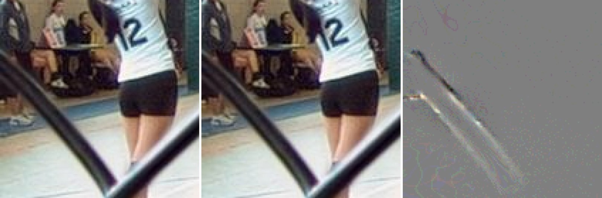
*4× crop at the fence wires. Left — base fusion. Middle — the former subtraction output,
visually almost identical (mean change 0.012 gray levels). Right — the difference,
amplified 16×. This once looked like evidence of a safely surgical edit; F54's
factory-GT complement showed that “too small to see” is not evidence of correctness.
The path is now disabled.*

The design rule this arc proved: **a specialist must be paired with its regime and
its matte class; its operator must first have a positive oracle ceiling on every
realistic model family; forward fit must be supplemented by independent ownership
evidence inside blur's null space; and every unvalidated regime must refuse.**

## The evidence, in one table

Every number is GT-referenced SSIM against a true all-in-focus reference unless
noted; each row is a different validation *regime*, because the project's core
discipline is that **a verdict in one regime is a hypothesis in every other**.

| Regime | Result | Honest caveat |
|---|---|---|
| Low-res, real content + GT (Real-MFF, 710 pairs) | perband **0.9918** > blend 0.9915 > pyramid 0.9913 | near-ceiling data; differences small but consistent |
| High-res (3072px) fine-depth benchmark | perband **0.9021** > pyramid 0.8926 > blend 0.8704 | synthetic (disk-PSF) defocus on real photos |
| Occlusion-honest (α-matte layered defocus) | perband **0.9434** > pyramid 0.9308 > blend 0.9283 | perband's lead *widens* under more honest physics |
| Real optical defocus (microscopy z-stacks) | perband sharpest — eye-confirmed | no GT exists; no-ref metric ordering confirmed visually |
| Deep stacks (N = 2 → 8) | quality **rises** with N for every method | broad soft weights act as multi-frame denoising |
| Exposure drift (±12% + WB tilt) | −0.025 SSIM broken → **−0.002** with default-on fix | clipped highlights slightly weaken the mean invariant |
| Joint one-sided opaque recovery | **Narrowly auto-enabled** after post-rule S29: 11/12 licensed, every fire improves all physical partitions; F78 `_010` boundary visually near-perfect | exactly two frames, validated size/formation only; F78 boundary rule still needs a fresh cross-family audit |

The metric itself got the same treatment as the engine: the standard gradient-transfer
metric (Q<sup>AB/F</sup>) collapses at high resolution for the same fixed-window reason —
so it, too, was made multi-scale (per pyramid level, mean-pooled), and the resulting
composite is the best GT-predictor at **both** resolutions (+0.785 / +0.869 Spearman).

## Run it

```bash
focusstack shots/*.jpg -o sharp.png                    # perband default, drift-corrected
focusstack shots/*.jpg -o sharp.png --harden 0         # disable spread-rejection (on by default)
focusstack big/*.png  -o sharp.png --fast              # ~1.5x; costs ~0.005–0.025 GT-SSIM
focusstack shots/*.jpg -o sharp.png --depth-out z.png  # + depth-from-focus map
```

---

## This is only the beginning

The engine is the *foundation* of a leading-edge system, not the finished one. The
frontier is tracked live in [`research/FRONTIER.md`](../research/FRONTIER.md) —
probed items spawn new sub-frontiers, and several were **closed as rigorous
negatives** (occlusion de-veiling loses even with oracle knowledge; deep-stack
spread import doesn't materialize), which is the discipline working: settled
questions, not lingering doubts.

**Near-term, already scoped:**
- **Real photographic deep stacks** — real handheld sweeps are now in
  (`mobiledepth`, 13 sweeps: they exposed misalignment robustness as a new regime
  axis, F37); the iPhone-12 GT dataset is the pending promotion gate.
- **Generalize joint-layer recovery without weakening refusal** — N>2 equations,
  bounded non-giant CoC banks, multiple occluders, and tiled >1600 px solving each
  require their own factory + holdout rather than inheriting the narrow license.
- **Contour-gate recall growth** — more features and model families can increase
  useful fires only after the operator's oracle ceiling and expanded safety labels
  hold.
- **A synthesis-aware no-reference metric** — today's no-ref metrics score any
  deviation from the sources as damage, so they cannot audit corrections that
  *improve on* every source; a metric that can would unlock runtime self-auditing.
- **Deep-stack alignment** — depth-dependent parallax is now corrected (a
  depth-aware pass after the global warp, plus per-pixel refusal of scene that
  parallax uncovered: 0.875 → 0.979 GT-SSIM on an analytic parallax factory).
  What remains is focus-breathing removal — a real 14% magnification change across
  a phone sweep that the global affine only partly absorbs — and object-level
  region grouping on top of it.
- **Noise-adaptive fusion** — low-light stacks where sensor noise mimics focus energy.
- **A learned no-reference metric** — close the remaining gap between no-GT scoring
  and truth for per-region decisions.

**Bigger swings, with groundwork already laid:**
- **One-pass neural fusion at classical quality** — distillation already *matches*
  the classical engine's quality (0.9885 vs 0.9888); the speed win awaits GPU
  hardware. The self-supervised training loss (no answer key) is designed and tested.
- **Object-aware fusion** — semantic segmentation as a routing layer above the
  structural one; the torch environment and per-region machinery already exist.
- **Real optical truth for scene recovery** — controlled macro/product captures
  where removing the occluder reveals the latent scene; ordinary real stacks can
  audit artifacts/refusal but cannot certify recovered texture.
- **Temporal focus stacking** — fusing focus sweeps from video with temporal
  coherence.

The current engineering record: [`research/STATE.md`](../research/STATE.md)
(checkpoint and next move), [`research/FINDINGS.md`](../research/FINDINGS.md)
(load-bearing conclusions), [`research/PLAYBOOK.md`](../research/PLAYBOOK.md)
(domain knowledge and every trap we hit), and
[`research/DEVSTYLE.md`](../research/DEVSTYLE.md) (the working method that produced
all of it — hypothesis → measure → look → A/B → gate — so any future session starts
where this one leaves off).

*The current inspection figures are regenerated by
`research/make_showcase_specialists.py`. Historical showcase figures are frozen
visual artifacts; their original generators remain in Git history.*
